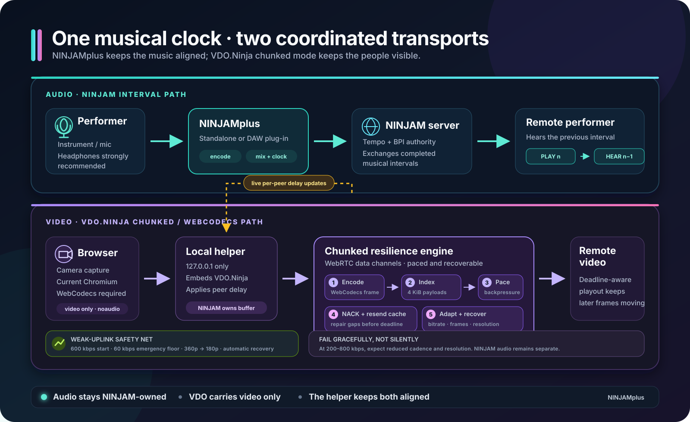

# NINJAMplus

**Interval-based online music collaboration with a resilient, synchronized VDO.Ninja video room.**

[](https://github.com/steveseguin/NinjamPlus/releases)
[](#downloads-and-formats)
[](https://github.com/steveseguin/NinjamPlus/actions/workflows/release.yml)

NINJAMplus is a standalone application and audio plug-in for musicians who want to play together over the Internet. It uses the NINJAM protocol for musically aligned audio, then adds an optional browser-based VDO.Ninja room whose video delay follows the NINJAM interval timing.

It is intended for rehearsals, open jams, remote lessons, streamed performances, and DAW-based sessions where musical timing matters more than conversational latency.



## How it works

NINJAM does not try to make a long-distance connection feel instant. Each performer plays during the current musical interval while hearing the other performers' previous interval. The intentional delay is normally one interval, so everyone remains on the same beat even when the network cannot provide studio-like round-trip latency.

NINJAMplus coordinates two separate transports:

1. **NINJAM carries the music.** The app or plug-in sends compressed audio to a NINJAM server, receives the other performers' interval audio, and mixes it against the shared tempo and BPI (beats per interval).
2. **VDO.Ninja carries optional video only.** Clicking **Video Room** starts a local loopback helper and opens a browser. The helper embeds VDO.Ninja, derives the room from the active NINJAM connection, and continuously applies per-peer video delay updates from the NINJAM timing data.
3. **Chunked mode protects weak uplinks.** WebCodecs encodes video into indexed chunks sent over WebRTC data channels. Pacing prevents an overloaded sender queue, NACKs request missing chunks from a bounded resend cache, and bitrate/resolution adaptation reduces bandwidth without moving the video timeline.

The browser room uses `noaudio=1`: NINJAM remains the audio clock and audio transport. Do not use the VDO.Ninja browser audio as a substitute for the NINJAM mix.

## Quick start

1. Download the package for your operating system from [Releases](https://github.com/steveseguin/NinjamPlus/releases).
2. Launch the standalone app, or load NINJAMplus in a compatible DAW.
3. Route an input into NINJAMplus and use headphones to avoid feedback.
4. Enter the NINJAM server address, user name, and password if required. Select **Anonymous** when the server permits anonymous guests.
5. Select **Connect**, accept any server licence prompt, and enable **Transmit** when ready.
6. Set local and remote channel levels. **Monitor Local** controls whether your own input is returned through NINJAMplus.
7. Optionally select **Video Room**, grant the browser camera permission, and leave that browser tab open during the session.

## Minimum requirements

| Area | Minimum | Recommended |
| --- | --- | --- |
| Operating system | A 64-bit Windows, macOS, or Linux system matching a release artifact | A currently supported OS with current audio, graphics, and camera drivers |
| Audio host | Standalone app, or a host supporting one of the supplied plug-in formats | A DAW with a stable audio buffer and explicit input/output routing |
| Audio hardware | Working input and output devices | An audio interface and wired headphones |
| NINJAM access | Server address and reachable server port; credentials if required | A geographically suitable server and wired or stable Wi-Fi networking |
| Audio upload | The selected 64–320 kbps stream bitrate, plus protocol and network headroom | 128 kbps or higher audio with substantial spare upstream capacity |
| Video browser | A current Chromium-family browser with WebCodecs, WebRTC data channels, and camera permission | Current Chrome or Edge with hardware acceleration enabled |
| Video upload | Video is optional; 200–800 kbps is a degraded recovery range, not a quality target | At least 1 Mbps of stable spare upload for useful motion; more for HD/60 fps |
| Video connectivity | HTTPS access to VDO.Ninja signalling and a viable WebRTC route | Direct UDP; TURN/TCP is supported but can add delay and reduce capacity |

The selected audio bitrate and the video bitrate share the same uplink. On constrained cellular service, preserve enough capacity for the NINJAM audio before enabling video.

## What to expect

- **Musical, not conversational, latency:** the interval delay is deliberate. Speech through the music path will also arrive on an interval boundary.
- **Video follows the music:** the helper delays each peer's video to match measured NINJAM timing. A freshly joined peer can take a moment to settle.
- **Quality first, graceful degradation on weak upload:** the default 720p30 profile begins around 2.5 Mbps and can fall to an emergency 60 kbps target. Sustained pressure lowers bitrate and resolution while preserving source timestamps and frame cadence.
- **Synchronization first:** normal adaptation never discards raw source frames. A severely impaired individual route may still skip timestamped frames as a last resort so it catches up instead of showing increasingly late video.
- **Automatic recovery:** healthy capacity lets the video return toward its source resolution and full bitrate. Sudden network changes may briefly force a keyframe or rebuffer without moving the NINJAM-owned playout target.
- **Audio remains the priority:** video can be closed without ending the NINJAM session.
- **Native reconnection:** unexpected NINJAM disconnects retry automatically with bounded exponential backoff. A manual disconnect, rejected licence, or invalid credentials will not reconnect in a loop.
- **Effects cost resources:** background blur/removal and high-quality 1080p modes need more CPU/GPU and upload bandwidth.

The 200–800 kbps path has been exercised with shaped Chromium traffic, TURN/UDP, burst loss, and changing upload limits. That validates graceful fallback logic, but it is not a guarantee for every carrier, phone hotspot, radio condition, or TURN route.

## VDO.Ninja chunked mode

The standard WebRTC video path is optimized for live motion and may collapse into a frozen or unusable feed when an uplink is extremely constrained. NINJAMplus instead enables VDO.Ninja's opt-in chunked/WebCodecs path for its synchronized video room.

### Data path

1. The browser captures the camera and WebCodecs encodes a frame.
2. The frame is split into small, indexed payloads.
3. A paced sender feeds the WebRTC data channel without allowing `bufferedAmount` to grow without bound.
4. The receiver detects missing indexes and sends NACK requests.
5. The sender or relay resends available payloads from a time-bounded cache.
6. A playout watchdog drops frames that can no longer complete before their deadline, allowing later frames to continue.
7. Buffer-pressure reports drive bitrate adaptation and 360p/emergency 180p tiers. Raw input cadence remains intact, and recovery uses hysteresis plus fresh keyframes.
8. NINJAMplus remains authoritative for each peer's playout delay and updates the helper live.

### Default resilience profile

These are implementation defaults for the NINJAMplus helper. They are advanced diagnostics/tuning controls, not settings most musicians need to change.

| URL parameter | Default | Purpose |
| --- | ---: | --- |
| `chunked`, `chunkbitrate`, `bitrate` | `2500` | Initial 720p30 video target in kbps for this integration |
| `maxvideobitrate`, `chunkadaptceil` | `2500` | Default adaptive ceiling in kbps; a selected quality preset can raise it |
| `chunkadaptfloor` | `60` | Emergency bitrate floor in kbps |
| `chunkindex` | `1` | Adds indexed reliability framing |
| `chunknack` | `1` | Requests missing chunks |
| `chunknackattempts` | `8` | Maximum resend requests before the playout deadline |
| `chunknackdelay` | `250` | Initial NACK spacing in milliseconds; measured RTT can influence retries |
| `chunkchunksize` | `4096` | Payload size in bytes |
| `chunkcache` | `30000` | Bounded resend-cache window in milliseconds; not video delay |
| `chunkedbuffer` | `500` | Sender pacing/adaptation window in milliseconds; bounds stale transport backlog during route collapse |
| `chunkadapt` | `bitrate` | Reduce bitrate without discarding raw source frames |
| `chunkadaptthreshold` | `500` | Pressure guard in milliseconds |
| `chunkadaptmaxdrop` | `0` | Disables global adaptive frame shedding so timestamps remain continuous |
| `chunkadaptinterval` | `1200` | Minimum interval between bitrate changes in milliseconds |
| `chunkadaptresolution` | `1` | Enables source, 360p, and emergency 180p tiers |
| `chunkbufferadaptive` | `0` | Prevents VDO.Ninja from overriding NINJAM-owned playout timing |

Advanced overrides can be added to the local helper URL. `chunkcodec` selects the chunked encoder preference; `codec` covers the RTP/fallback path. Supported preferences in the helper UI are Auto, VP8, VP9, H.264, and AV1. Browser and hardware support still determine what can actually be used.

Transport diagnostics can pass through `relay`, `tcp`, `turn`, `stun`, `speedtest`, `wss`, and `wss2`. `vdoBase` or `vdoUrl` can point the iframe at another VDO.Ninja deployment. Changing buffer, transport, or deployment parameters can defeat synchronization or connectivity; treat them as operator/test controls.

## Controls and settings

| Control | What it does |
| --- | --- |
| **Connect / Disconnect** | Starts or ends the native NINJAM server session |
| **Transmit** | Sends the routed input to the NINJAM session |
| **Monitor Local** | Returns the local input through the app/plug-in mix |
| **Voice Chat** | Provides the app's voice-chat control separately from the main music workflow |
| **Audio bitrate** | Selects 64, 96, 128, 160, 192, 256, or 320 kbps; default is 128 kbps |
| **Video Room** | Opens the synchronized VDO.Ninja browser helper for the connected server |
| **Vertical mixer layout** | Changes channel-strip orientation for the available screen space |
| **Auto Level** | Applies the app's automatic level/soft-limiter behavior |
| **MIDI Settings / MIDI-OSC target** | Configures performance control and outbound integration |
| **Chord Detection** | Enables chord analysis in the interface |
| **Sample Pads / Looper** | Enables the sample-pad and loop workflow |
| **Metronome Sound / Output** | Selects the click sound and stereo-pair or mono destination |
| **Transport Sync Source** | Uses the VST host or Ableton Link as the transport reference |
| **Ableton Link Audio** | Enables the Ableton Link audio workflow |
| **Mobile Hotspot Keepalive** | Keeps light traffic active to reduce hotspot/cellular idle teardown |
| **Automatically Reconnect** | Persists the default-on native NINJAM reconnect behavior |
| **Check for Updates** | Checks for a newer NINJAMplus release |

### Video Room toolbar

| Setting | Options / behavior |
| --- | --- |
| **OBS view** | Tiles, Rows, or Columns; show all cameras or a numbered slot, then copy an OBS browser-source link |
| **Codec** | Auto, VP8, VP9, H.264, or AV1; saved for the next video reconnect |
| **Quality** | 720p30 default, 720p60, 1080p30, 1080p HQ at 30/60 fps, or 360p30 |
| **Camera FX** | Off, background blur, background removal, green screen, or an image background |
| **Sync display** | Shows room state, peer offsets, beat/BPI information, and rebuffer/keyframe/decoder warnings |

The helper normally binds only to `127.0.0.1` and opens the system browser. If it cannot start, NINJAMplus falls back to a direct VDO.Ninja page, but that fallback cannot receive the helper's live NINJAM buffer updates.

## Downloads and formats

| Platform | Supplied formats |
| --- | --- |
| Windows x64 | Standalone, VST3, and installer |
| macOS | Standalone, VST3, AU, and `.pkg` |
| Linux x64 | Standalone, VST3, and LV2 |

Every push to the maintained fork runs functional tests and produces an immutable prerelease with SHA-256 checksums. Normal version tags produce full releases.

macOS artifacts are currently ad-hoc signed when Apple signing/notarization credentials are not configured. Depending on local Gatekeeper policy, users may need to explicitly approve the application. Always compare downloaded files against `SHA256SUMS.txt` from the release.

## Troubleshooting

- **No audio:** verify DAW/standalone input routing, enable **Transmit**, check channel levels, and confirm that the server port is reachable.
- **Feedback or echo:** use headphones and check **Monitor Local** plus any direct-monitor path on the audio interface.
- **Video room does not open:** connect to NINJAM first, allow the browser launch, and check local firewall/security software for a blocked loopback helper.
- **Camera is missing:** grant camera permission, select the camera in the browser, and refresh the helper page if the permission changed after loading.
- **Video freezes on cellular:** close other upload-heavy applications, use 360p, disable camera effects, and avoid forcing a high adaptation floor. A relay/TCP route can also be the bottleneck.
- **Video is not aligned yet:** allow the peer offset to settle. Avoid manually overriding `buffer` or enabling VDO adaptive buffering in a synchronized room.
- **Reconnect does not occur:** ensure **Automatically Reconnect** is enabled. Manual disconnects and authentication/licence failures intentionally require user action.

## Building and testing

The project uses CMake 3.22+, C++17, JUCE 8, and fetched/pinned audio dependencies.

```sh
git submodule update --init --recursive
cmake -S . -B build -DCMAKE_BUILD_TYPE=Release
cmake --build build --config Release --target NINJAM_VST3_All
```

Run the deterministic browser-helper checks with:

```sh
npm ci
npx playwright install chromium
npm test
```

Windows CI additionally validates the VST3 with checksum-pinned pluginval at strictness level 5. Release CI builds all supported operating systems and publishes checksums with the artifacts.

For manual network validation, test the actual helper in the external browser it launches. A normal browser tab or unrelated embedded webview does not reproduce the helper's loopback API, timing updates, or iframe configuration.

## Project and legal notes

- Maintained fork: [steveseguin/NinjamPlus](https://github.com/steveseguin/NinjamPlus)
- Releases: [github.com/steveseguin/NinjamPlus/releases](https://github.com/steveseguin/NinjamPlus/releases)
- VDO.Ninja: [vdo.ninja](https://vdo.ninja/)
- Third-party and upstream notices: [LEGAL_NOTICES.txt](LEGAL_NOTICES.txt) and [THIRD_PARTY_NOTICES.md](THIRD_PARTY_NOTICES.md)

NINJAMplus contains and builds on multiple upstream projects. Review the included notices before redistributing binaries or source.
